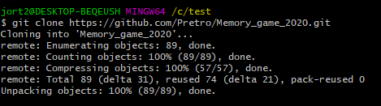

# Memory_game_2020
The project is based on the need of making a memory game for the second part of the milestone project. The game is based on the covid-19 virus. As we all kow, 2020 is a year that will be difficult to forget. 
The main goal of the game is to have fun, and to give a message reminding everyone who play that not to forget about taking precautions.
The game is is designed to be responsibe on a range of devices. 
You can test the game on the following link:

+ [play the game](https://pretro.github.io/Memory_game_2020/) 

# __UX__

__The purpose of this game is to :__

+ Entertainment for the user and to have a good time playing.
+ Training of the mind.

## __User stories__

### First time visitors goals
As a user of this game, i want to

1. Be able to easy navegate through the gameboard.
2. Easy for me to understand what the gameis about.
3. Be able to play the game must be seen in different browsers.
4. Read and understand the texts.
5. Have the game responsive in several devices
6. See the pictures with a good resolution.
7. See different pictures who are not so similar toeach other

### Returning time visitors goals
1. As a Returning Visitor, i want to see improvments in the game.
2. As a Returning Visitor, i want to see if there are any updates
3. As a Returning Visitor, i want to see what is new in the game.

### Frequent time visitors goals
1. As a Frequent User, i want to check if there are any newly added challenges in the game.
2. As a Frequent User, i want to check to see if there are any new features like pictures or buttons.
3. As a Frequent User, i want to be able to compete against myself and others.

+ ### Design
* _Color Scheme_
    * The main color of the game is darkorange and antiquewhite for the text.
    * Red and yellow are for the button and card borders

* Typography
    * The **Arial, Helvetica, sans-serif** font is the main font used throughout the game.
    * As a typeface, Arial is one of the most used designs in recent times thanks to the fact that it has specific characteristics that make it more accessible and it has become a basic element for textual content.
    Arial typeface is easy to read in a variety of sizes and in a variety of applications, not only on screen but also in print.
    * The **Helvetica** family is characterized by its neutrality, versatility and high readability. It is a very suitable typeface for informational posters.
    * **Sans serif** it is usually used for titles that seek to make an impact, for headlines that must be read from a distance or for reading bodies that are relatively short.
    
* Imagery
    * Imagery is the face of the game. Though the background its just a color. The main goal of the game are the images used. The images are inspired in the covid-19 advises, and work as a reminder of what we must do nowadays to stay safe. 
    * The reason why the game do not have a background image and just color is to make it more easier for the user to concentrate on the game cards.    

* ## Wireframes ##

    + [Wireframe 1](wireframes/Memory_game.png)
    + [Wireframe 2](wireframes/Memory_mobile.png)

* ## Features ##
    + Responsive on all devices
    + Interactive elements

* # Technologies Used #
     Languages Used
    * [HTML5](https://en.wikipedia.org/wiki/HTML5)
    * [CSS3](https://en.wikipedia.org/wiki/CSS)
    * [Javascript](https://en.wikipedia.org/wiki/JavaScript)

  ## Frameworks, Libraries & Programs Used ## 
  
  For the making of this project, the following technologies has been used.

+ [Gitpod](https://www.gitpod.io/) 

    Gitpod is used as the enviroment program were the page was made.

+ [Github](https://github.com/) 

    Github is used as the development platform, you can upload your code and make repositories. This platform, gives other users
    the opportunity to see your repositories if made as open source code.

+ [HTML5](https://www.w3schools.com/)
    
    HTML is the language use to make websites. Since it is the standard markup languages for webpages.

+ [CSS](https://www.w3schools.com/css/default.asp)

    CSS is the language used to style the pages made in HTML. 

+ [W3C Valitor HTML](https://validator.w3.org/)

    W3C validator is the tool we use to check the markup validity in HTML.

+ [WC Valitor CSS](https://jigsaw.w3.org/css-validator/#validate_by_input)

    As mentioned above, this tool is use to check for errors in the css code.

+ [JSHint](https://jshint.com/)

    This page is use to check for errors in the JS code.

+ [Googlefonts](https://fonts.google.com/)

    The fonts used in this project are taken from Googlefonts.

+ [Youtube](https://www.youtube.com/)

    I use this site to get inspiration from other projects and to search informtaion regarding source code. 

+ [Bootstrap 4](https://getbootstrap.com/)

    Front-end opensource toolkit that is use for the making of this project, and to customize the site to mobile responsive.

+  [Reposinator](https://www.responsinator.com/)
    
    Reposinator is use to check how your website look in different devices in responsive mode.

+   [Devtool](https://developers.google.com/web/tools/chrome-devtools)

    use to search for error in the making of the webpage.

# Testing

    The language of the game such as HTML, CSS and Javascript were tested for errors and warnings in the code.

    1. W3C Validator HTML.

    2. W3C validator CSS.

    3. JShint

##  Testing User Stories from User Experience (UX) Section 

* As a first time Visitor, i want to be able to easy navegate through the gameboard.

    a. It must be easy for me to understand what the game is about.

    b. Be able to play the game in different browsers and units.

    c. the pictures must be easy to indentify and with good resolution.

* As a returning time visitors 

    a. i expect to see improvments in the game, updates.

    b. and to see what is new.

* As Frequent time visitors

    a. I want to check if there are any newly added challenges in the game.

    b. There must be updates withiin that can enable you to pick different scenarios.

    c. Within a period of time have a hall of fame were i can compete with other players and be shown in a list of who is the best.

## Further Testing

*  During my test period i focus on the user stories.
    The game has been tested in different browser, such as.

    1. Chrome

    2. Firefox

    3. Safari

    4. Microsoft edge

* The responsive part has also been tested in http://www.responsinator.com/ for  

    1. Ipad

    2. Iphone

    3. Android

    4. Laptop

* Friends and family members played to review the game and to point out any bugs and/or user experience issues.

## Known Bugs ##

    + The gameboard shows at the left side of the screen instead of in the center in this devices
        iPhone eXpensive landscape · width: 734px.
        Android (Pixel 2) landscape · width: 684px
        iPhone 6-8 landscape · width: 667px
        iPad portrait · width: 768px
    + This is not an reason that made the game cannot be played or make difficultto play.   

# Deployment #

To deploy this porject, i used the hosting platform of Github
The step to deploy this project were as follows.

### __GitHub Pages__
The project was deployed to GitHub Pages using the following steps...

1. Log in to GitHub and locate the GitHub Repository
2. Go to settings
3. Under "GitHub Pages", use the None drop-down menu and select a publishing source.
4. Next choose the root.
5. Click save and you will get the link to your webpage where others can enter and interact. 

### __Forking the GitHub Repository__ ###
By forking the GitHub Repository we make a copy of the original repository on our GitHub account to view and/or make changes without affecting the original repository by using the following steps...

Log in to GitHub and locate the GitHub Repository
At the top of the Repository (not top of page) just above the "Settings" Button on the menu, locate the "Fork" Button.
You should now have a copy of the original repository in your GitHub account.

# Cloning a repository to GitHub Desktop #

1. On GitHub, navigate to the main page of the repository.

2. Above the list of files, click "Code".

3. Mark the HTTPS tag ad press the copy icon at the end of the link.

4. Open Git Bash

5. Change the current working directory to the location where you want the cloned directory to be made.
   Type  "git clone", and then paste the URL you copied.

     $ git clone https://github.com/YOUR-USERNAME/YOUR-REPOSITORY
6. Press enter and you should see the following code on the screen

    

# Credits

__Code__

* [Bootstrap 4](https://getbootstrap.com/) Library used throughout the project in the making of the game and to make it responsive.
* The code was validated in the following pages for error correction:

    + [W3C Valitor HTML](https://validator.w3.org/)
    + [JSHint](https://jshint.com/)
    + [CSS](https://www.w3schools.com/css/default.asp)

__Content__

* All content (this means the coding) was made by the developer

__Media__
* All Images were taken from the following site:
    + [Pexels](https://www.pexels.com/sv-se/)

__Acknowledgements__

* My friend Christian Mossberg, for his guidence and support in the making of this project.

* My Mentor for continuous helpful feedback.

* Tutor support at Code Institute for their support.